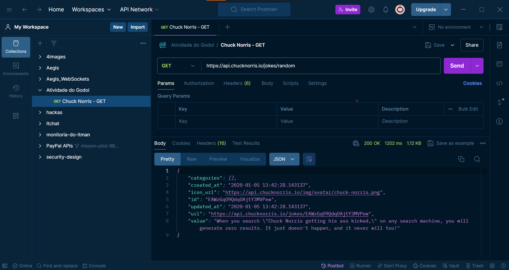
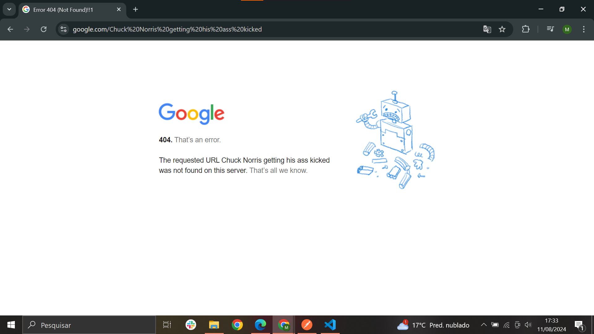
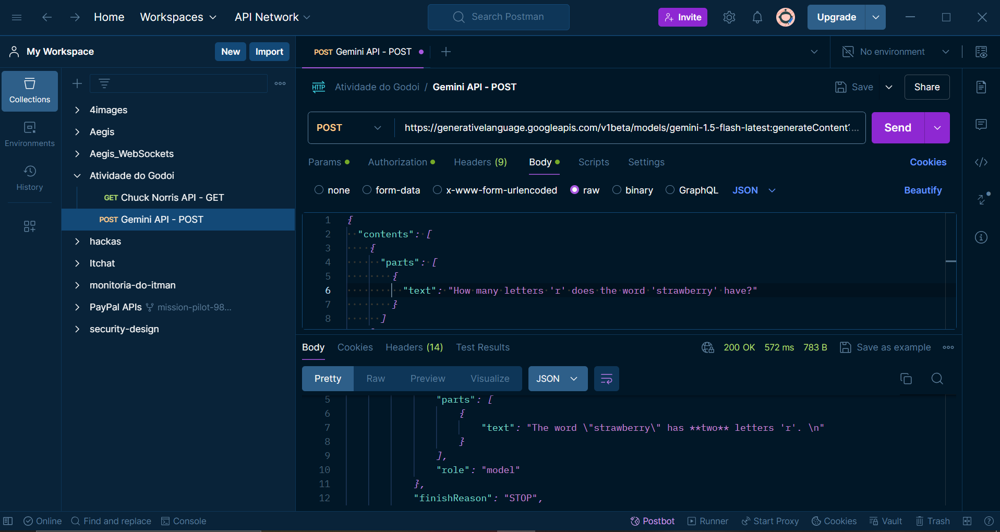
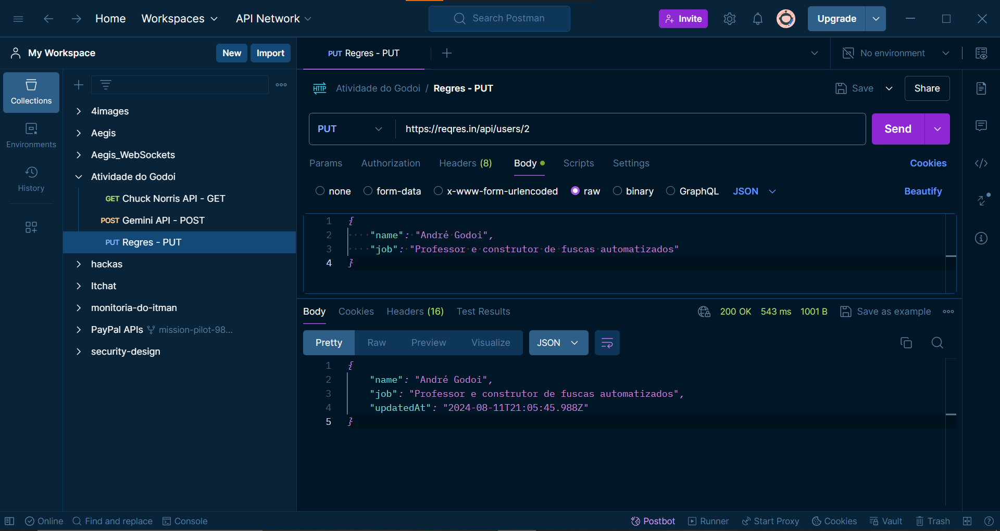

<div align="justify">

# Ponderada: Postman

## Barema da atividade

Escolha uma API disponível para uso e com documentação. Com a ferramenta [Postman](https://www.postman.com):

1. Consulte a documentação e selecione **3 tipos de requisição** dentre os disponíveis (e.g., GET, POST, PUT).
2. Realize as requisições selecionadas (no mínimo 3 requisições de tipos diferentes).
3. Para cada requisição, descreva:
   - **Objetivo**
   - **Parâmetros e valores utilizados**
   - **Resultados esperados e obtidos**

Escreva um relatório técnico com as seguintes seções:

1. **Introdução**: 
   - Objetivo (2 pontos)

2. **Metodologia**: 
   - Requisições conforme a documentação (com referência ABNT) (3 pontos)

3. **Resultados**: 
   - Para cada requisição, descrever:
     - Objetivo
     - Parâmetros e valores utilizados
     - Resultados esperados e obtidos (3 pontos)

4. **Conclusão**:
   - Relembrar objetivo e escrever se foi alcançado, justificando a resposta (2 pontos)

# Relatório atividade Postman

## 1. Introdução

&emsp;O objetivo do relatório em questão é explorar o uso da ferramenta Postman a partir de requisições utilizando APIs públicas. Foram desenvolvidos testes com diferentes APIs dado uma dificuldade inicial de encontrar apenas uma API com 3 métodos distintos para testes. Sendo assim, foram escolhidas as seguintes APIs:

- [API Chuck Norris](https://api.chucknorris.io/#!): É uma API gratuita para se obter fatos sobre o Chuck Norris. Essa API será utilizada para a realização da operação de GET.
- [Gemini API](https://ai.google.dev/): É a API da IA generativa do google, disponível para uso gratuito até certo ponto, tendo só a necessidade de autenticação com o uso de uma chave de acesso. Essa será utilizada para a realização da operação de POST.
- [Reqres API](https://reqres.in/): O Reqres é uma API de teste que permite simular operações comuns de CRUD (Create, Read, Update, Delete). Essa API será utilizada para a realização da operação de PUT.

&emsp;Através dos testes realizados com essas APIs será possível ampliar a compreensão sobre requisições web e como utilizar tais ferramentas para a construção de soluções e aplicações.

## 2. Metodologia

&emsp;O seguinte estudo usou da metodologia de enviar 3 requisições dos tipos GET, POST e PUT para as 3 APIs selecionadas, sendo elas respectivamente: API Chuck Norris, Gemini API e Reqres API. As seguintes requisições foram enviadas através da ferramenta Postman com suas respectivas configurações que são detalhadas em cada uma das seções abaixo. Vale ressaltar que a requisição para a API do Gemini utiliza de informações sensíveis como a chave da API do autor, sendo assim, essa informação foi omitida para fins de segurança e aderência à lei geral de proteção de dados.

## 3. Resultados

### 3.1. Chuck Norris API - GET

**Objetivo:** Obter um fato sobre o Chuck Norris.

**Parâmetros e valores utilizados:**

**Método:** GET  
**URL:** https://api.chucknorris.io/jokes/random

**Resultado esperado:** Retorno de um JSON com um campo "value" contendo um fato sobre o Chuck Norris, além de outros campos com dados sobre o fato como os atributos: categories, created_at, icon_url, id, updated_at e url.

**Resultado obtido:**
```json
{
    "categories": [],
    "created_at": "2020-01-05 13:42:28.143137",
    "icon_url": "https://api.chucknorris.io/img/avatar/chuck-norris.png",
    "id": "EAWzGqO9QdqOAjtY3MVPew",
    "updated_at": "2020-01-05 13:42:28.143137",
    "url": "https://api.chucknorris.io/jokes/EAWzGqO9QdqOAjtY3MVPew",
    "value": "When you search \"Chuck Norris getting his ass kicked,\" on any search machine, you will generate zero results. It just doesn't happen, and it never will too!"
}
```

<div align="center">
    <p><b>Figura 1</b> - Requisição GET para a API do Chuck Norris</p>
    
    <p>Fonte: Elaborado pelo autor</p>
</div>


&emsp;O resultado atendeu ao que era esperado considerando os objetivos, além disso, o fato mostra-se verdadeiro uma vez que foram encontrados 0 resultados para a pesquisa mencionada.

<div align="center">
    <p><b>Figura 2</b> - Chuck Norris getting his ass kicked</p>
    
    <p>Fonte: Elaborado pelo autor</p>
</div>

### 3.2. Google Gemini API - POST

**Objetivo:** Enviar um prompt para a API do Gemini perguntando quantas letras "r" tem a palavra "strawberry".

**Parâmetros e valores utilizados:**

**Método:** POST  
**URL:** https://generativelanguage.googleapis.com/v1beta/models/gemini-1.5-flash-latest:generateContent?key=YOUR_API_KEY   
**Body:** 

```json
{
  "contents": [
    {
      "parts": [
        {
          "text": "How many letters 'r' does the word 'strawberry' have?"
        }
      ]
    }
  ]
}

```

**Obs:** O campo YOUR_API_KEY foi substituído pela chave da API do autor, para evitar vazamento de informações, esse dado não será divulgado nesse relatório.

**Resultado esperado:** Espera-se o retorno de um JSON com a resposta da IA generativa, além de outros dados referentes ao uso de tokens do modelo, regras de segurança e informações úteis para desenvolvedores.

**Resultado obtido:**
```json
{
    "candidates": [
        {
            "content": {
                "parts": [
                    {
                        "text": "The word \"strawberry\" has **two** letters 'r'. \n"
                    }
                ],
                "role": "model"
            },
            "finishReason": "STOP",
            "index": 0,
            "safetyRatings": [
                {
                    "category": "HARM_CATEGORY_SEXUALLY_EXPLICIT",
                    "probability": "NEGLIGIBLE"
                },
                {
                    "category": "HARM_CATEGORY_HATE_SPEECH",
                    "probability": "NEGLIGIBLE"
                },
                {
                    "category": "HARM_CATEGORY_HARASSMENT",
                    "probability": "NEGLIGIBLE"
                },
                {
                    "category": "HARM_CATEGORY_DANGEROUS_CONTENT",
                    "probability": "NEGLIGIBLE"
                }
            ]
        }
    ],
    "usageMetadata": {
        "promptTokenCount": 14,
        "candidatesTokenCount": 13,
        "totalTokenCount": 27
    }
}
```

<div align="center">
    <p><b>Figura 3</b> - Requisição POST para a API do Gemini</p>
    
    <p>Fonte: Elaborado pelo autor</p>
</div>

&emsp;O resultado atendeu ao que era esperado considerando os objetivos de obter um um JSON com os dados necessários para desenvolvedores, informações sobre uso de tokens do modelo e efetivamente a resposta do mesmo. Embora esse não seja o foco do relatório, é válido ressaltar que a resposta do modelo não é verdadeira, entretanto, esse é um exercício interessante de engenharia de prompt, uma vez que mudando a pergunta para uma abordagem iterativa, a IA é capaz de responder corretamente.

**Nova requisição POST com prompt reestruturado:**

```json
{
  "contents": [
    {
      "parts": [
        {
          "text": "Iterate over each letter of the word strawberry, say whether or not that letter is the letter 'r', then tell me how many 'r's you've found."
        }
      ]
    }
  ]
}

```

**Resposta simplificada do modelo:**
```json
"parts": [
    {
        "text": "Okay, here's the breakdown:\n\n**Word:** strawberry\n\n**Iteration:**\n\n* **s:** Not an 'r'\n* **t:** Not an 'r'\n* **r:**  It's an 'r'! (Found 1 'r')\n* **a:** Not an 'r'\n* **w:** Not an 'r'\n* **b:** Not an 'r'\n* **e:** Not an 'r'\n* **r:** It's an 'r'! (Found 2 'r's)\n* **r:** It's an 'r'! (Found 3 'r's)\n* **y:** Not an 'r'\n\n**Result:** There are **three** 'r's in the word strawberry. \n"
    }
],
```

&emsp;Daqui em diante, cada vez mais existirão APIs focadas em inteligências artificiais generativas, principalmente com seus avanços e recursos mais sofisticados como chamada de função, reconhecimento de arquivos e outros recursos, sendo necessário que mesmo na utlização de APIs os desenvolvedores estejam atentos sobre como utlizar essas ferramentas da melhor forma possível.


### 3.3. Reqres - PUT

**Objetivo:** Realizar a atualização de um usuário mockado.

**Parâmetros e valores utilizados:**

**Método:** PUT  
**URL:** https://reqres.in/api/users/2

**Body:**
```json
{
    "name": "André Godoi",
    "job": "Professor e construtor de fuscas automatizados"
}
```

**Resultado esperado:** Retorno de um JSON com os campos "name" e "job" atualizados, além de outro campo "updatedAt" com a data na qual a requisição PUT foi concluída.

**Resultado obtido:**
```json
{
    "name": "André Godoi",
    "job": "Professor e construtor de fuscas automatizados",
    "updatedAt": "2024-08-11T21:05:45.988Z"
}
```

<div align="center">
    <p><b>Figura 4</b> - Requisição PUT para a API Reqres</p>
    
    <p>Fonte: Elaborado pelo autor</p>
</div>


&emsp;O resultado atende o que era esperado nos objetivos dessa requisição.

## 4. Conclusão

&emsp;Todos os testes realizados ao longo desse relatório obtiveram sucesso ao enviar requisições de GET, POST e PUT utilizando diferentes APIs e a ferramenta Postman para testes. O teste da requisição GET foi realizado com a API Chuck Norris Jokes que teve sucesso ao retornar o JSON esperado com um fato sobre o ator. O teste da requisição POST foi realizado com a API do Gemini, a inteligência artificial do Google, também obtendo sucesso no envio da requisição de um prompt e recebimento da resposta, nesse teste uma segunda requisição foi enviada para fins de conhecimentos sobre engenharia de prompt. Por fim, o teste da requisição PUT foi realizado com a API Reqres, ferramenta essa muito utlizada para testes mockados, principalmente por desenvolvedores front-end, o envio da requisição e recebimento dos dados também foi um sucesso. Pode-se concluir a importância de APIs na construção de soluções de software, além de pontos importantes para garantir respostas coerentes para os diferentes casos de uso que essas ferramentas podem ter.

## 5. Referências
- CHUCK NORRIS API. Disponível em: https://api.chucknorris.io/#!. Acesso em: 11 ago. 2024.
- GEMINI API. Disponível em: https://ai.google.dev/gemini-api/docs?hl=pt-br. Acesso em: 11 ago. 2024.
- GOOGLE GEMINI API. Disponível em: https://ai.google.dev/. Acesso em: 11 ago. 2024.
- REQRES API. Disponível em: https://reqres.in/. Acesso em: 11 ago. 2024.


</div>